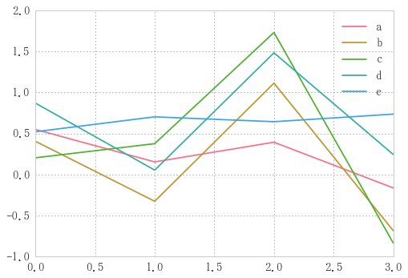
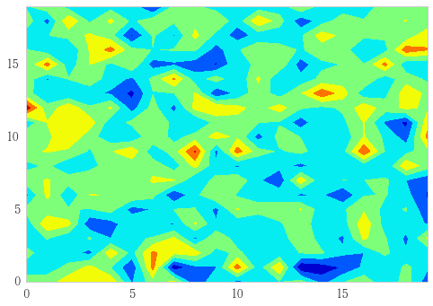
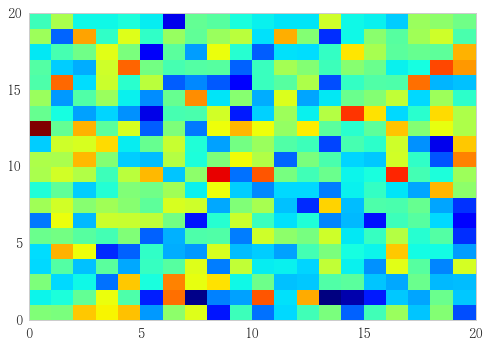
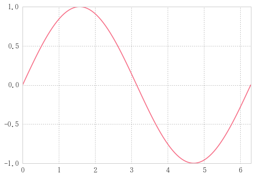
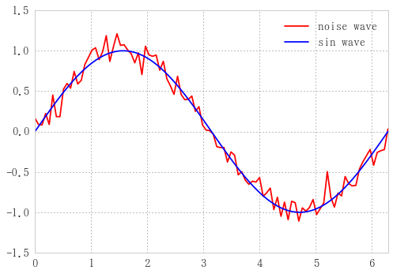

# サンプルデータ

## 線形データ


```python
n=20
```


```python
a = np.arange(n).reshape(4, -1); a  # 5列の行列
```


    array([[ 0,  1,  2,  3,  4],
           [ 5,  6,  7,  8,  9],
           [10, 11, 12, 13, 14],
           [15, 16, 17, 18, 19]])


```python
df = pd.DataFrame(a, columns=list('abcde')); df
```


<div>
<table border="1" class="dataframe">
  <thead>
    <tr style="text-align: right;">
      <th></th>
      <th>a</th>
      <th>b</th>
      <th>c</th>
      <th>d</th>
      <th>e</th>
    </tr>
  </thead>
  <tbody>
    <tr>
      <th>0</th>
      <td>0</td>
      <td>1</td>
      <td>2</td>
      <td>3</td>
      <td>4</td>
    </tr>
    <tr>
      <th>1</th>
      <td>5</td>
      <td>6</td>
      <td>7</td>
      <td>8</td>
      <td>9</td>
    </tr>
    <tr>
      <th>2</th>
      <td>10</td>
      <td>11</td>
      <td>12</td>
      <td>13</td>
      <td>14</td>
    </tr>
    <tr>
      <th>3</th>
      <td>15</td>
      <td>16</td>
      <td>17</td>
      <td>18</td>
      <td>19</td>
    </tr>
  </tbody>
</table>
</div>


## ランダムデータ


```python
r = np.random.randn(4, 5); r
```


    array([[ 0.54897778,  0.4042393 ,  0.20286199,  0.87018197,  0.52087064],
           [ 0.15261458, -0.32760599,  0.37528929,  0.05240482,  0.70252085],
           [ 0.39302499,  1.11363247,  1.7319287 ,  1.48387384,  0.64328427],
           [-0.16466795, -0.68573552, -0.83629887,  0.24340992,  0.73577441]])


```python
df = pd.DataFrame(r, columns=list('abcde')); df
```


<div>
<table border="1" class="dataframe">
  <thead>
    <tr style="text-align: right;">
      <th></th>
      <th>a</th>
      <th>b</th>
      <th>c</th>
      <th>d</th>
      <th>e</th>
    </tr>
  </thead>
  <tbody>
    <tr>
      <th>0</th>
      <td>0.548978</td>
      <td>0.404239</td>
      <td>0.202862</td>
      <td>0.870182</td>
      <td>0.520871</td>
    </tr>
    <tr>
      <th>1</th>
      <td>0.152615</td>
      <td>-0.327606</td>
      <td>0.375289</td>
      <td>0.052405</td>
      <td>0.702521</td>
    </tr>
    <tr>
      <th>2</th>
      <td>0.393025</td>
      <td>1.113632</td>
      <td>1.731929</td>
      <td>1.483874</td>
      <td>0.643284</td>
    </tr>
    <tr>
      <th>3</th>
      <td>-0.164668</td>
      <td>-0.685736</td>
      <td>-0.836299</td>
      <td>0.243410</td>
      <td>0.735774</td>
    </tr>
  </tbody>
</table>
</div>


```python
df.plot()
```


    <matplotlib.axes._subplots.AxesSubplot at 0x284e8dc5668>





```python
df = pd.DataFrame(np.random.randn(n,n))
```


```python
plt.contourf(df, cmap='jet')
```


    <matplotlib.contour.QuadContourSet at 0x284e9291cf8>





等高線表示


```python
plt.pcolor(df, cmap='jet')
```


    <matplotlib.collections.PolyCollection at 0x284e930ca58>





カラーマップ表示

## sin波


```python
n=100
x = np.linspace(0, 2*np.pi, n)
```


```python
s = pd.Series(np.sin(x), index=x)
s.plot()
```


    <matplotlib.axes._subplots.AxesSubplot at 0x284e92cf0f0>





sin波


```python
snoise = s + 0.1 * np.random.randn(n)
sdf = pd.DataFrame({'sin wave':s, 'noise wave': snoise})
sdf.plot(color=('r', 'b'))
```


    <matplotlib.axes._subplots.AxesSubplot at 0x284e9353cc0>





ノイズをのせた

## 正規分布


```python
from  scipy import stats as ss
```


```python
median = x[int(n/2)]  # xの中央値
g = pd.Series(ss.norm.pdf(x, loc=median), x)
g.plot()
```


    <matplotlib.axes._subplots.AxesSubplot at 0x284e93c1080>


```python
gnoise = g + 0.01 * np.random.randn(n)
df = pd.DataFrame({'gauss wave':g, 'noise wave': gnoise})
df.plot(color=('r', 'b'))
```


    <matplotlib.axes._subplots.AxesSubplot at 0x284e94764e0>


## log関数


```python
median = x[int(n/2)]  # xの中央値
x1 = x + 10e-3
l = pd.Series(np.log(x1), x1)
l.plot()
```


    <matplotlib.axes._subplots.AxesSubplot at 0x284e94ac080>


```python
lnoise = l + 0.1 * np.random.randn(n)
df = pd.DataFrame({'log wave':l, 'noise wave': lnoise})
df.plot(color=('r', 'b'))
```


    <matplotlib.axes._subplots.AxesSubplot at 0x284e951fc18>


```python

```
