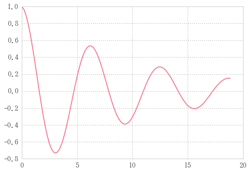
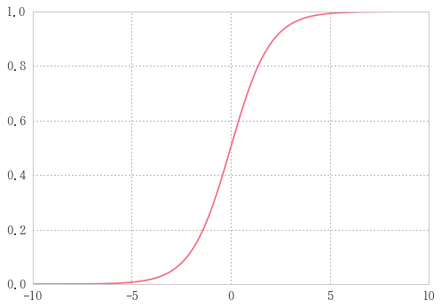

# サンプルデータ


```python
import numpy as np
import pandas as pd
import matplotlib .pyplot as plt
import seaborn as sns
%matplotlib inline
```

## 線形データ

n=20


```python
a = np.arange(n).reshape(4, -1); a  # 5列の行列
```


    array([[ 0,  1,  2,  3,  4],
           [ 5,  6,  7,  8,  9],
           [10, 11, 12, 13, 14],
           [15, 16, 17, 18, 19]])


```python
df = pd.DataFrame(a, columns=list('abcde')); df
```


<div>
<table border="1" class="dataframe">
  <thead>
    <tr style="text-align: right;">
      <th></th>
      <th>a</th>
      <th>b</th>
      <th>c</th>
      <th>d</th>
      <th>e</th>
    </tr>
  </thead>
  <tbody>
    <tr>
      <th>0</th>
      <td>0</td>
      <td>1</td>
      <td>2</td>
      <td>3</td>
      <td>4</td>
    </tr>
    <tr>
      <th>1</th>
      <td>5</td>
      <td>6</td>
      <td>7</td>
      <td>8</td>
      <td>9</td>
    </tr>
    <tr>
      <th>2</th>
      <td>10</td>
      <td>11</td>
      <td>12</td>
      <td>13</td>
      <td>14</td>
    </tr>
    <tr>
      <th>3</th>
      <td>15</td>
      <td>16</td>
      <td>17</td>
      <td>18</td>
      <td>19</td>
    </tr>
  </tbody>
</table>
</div>


## ランダムデータ

r = np.random.randn(4, 5); r


```python
df = pd.DataFrame(r, columns=list('abcde')); df
```


    array([[-0.76798351,  0.39545824, -0.18938856, -1.34485011,  0.8722842 ],
           [ 0.87813634, -0.80880185,  1.10395955,  2.44202835,  0.04306526],
           [ 0.33626586,  0.29698914,  0.82286026, -1.07663082, -0.3184203 ],
           [-0.34109916, -0.04371998,  0.9267362 , -0.27744202, -0.16861789]])


```python
df.plot()
```


    <matplotlib.axes._subplots.AxesSubplot at 0x284ea821780>


```python
df = pd.DataFrame(np.random.randn(n,n))
```


```python
plt.contourf(df, cmap='jet')
```


    <matplotlib.contour.QuadContourSet at 0x284ea934a20>


等高線表示


```python
plt.pcolor(df, cmap='jet')
```


    <matplotlib.collections.PolyCollection at 0x284ea9ad3c8>


カラーマップ表示

## sin波


```python
n=100
x = np.linspace(0, 2*np.pi, n)
```


```python
s = pd.Series(np.sin(x), index=x)
s.plot()
```


    <matplotlib.axes._subplots.AxesSubplot at 0x284ea8e3fd0>


sin波


```python
snoise = s + 0.1 * np.random.randn(n)
sdf = pd.DataFrame({'sin wave':s, 'noise wave': snoise})
sdf.plot(color=('r', 'b'))
```


    <matplotlib.axes._subplots.AxesSubplot at 0x284ea9f6588>


ノイズをのせた

## 減衰振動


```python
n=100
x = np.linspace(0, 6*np.pi, n)
```


```python
dos = np.exp(-0.1*x) * np.cos(x)
plt.plot(x, dos)
```


    [<matplotlib.lines.Line2D at 0x1ccb9a0d6d8>]





$$ Ce^{-\zeta\omega_0t}\cos \left({\omega_0\sqrt{1-\zeta^2}t-\alpha} \right) $$

## 正規分布


```python
import scipy.stats as ss
```


```python
n=100
x = np.linspace(-5, 5, n)
```


```python
median = x[int(n/2)]  # xの中央値
g = pd.Series(ss.norm.pdf(x, loc=median, scale=3), x)
g.plot()
```


    <matplotlib.axes._subplots.AxesSubplot at 0x28757379780>


$$y(x) = \exp \left( \frac{-x^2/2}{\sqrt{2\pi}} \right) $$

$loc$と$scale$が指定されたときは、$x$が$\frac{x-loc}{scale}$となる。


```python
gnoise = g + 0.01 * np.random.randn(n)
df = pd.DataFrame({'gauss wave':g, 'noise wave': gnoise})
df.plot(color=('r', 'b'))
```


    <matplotlib.axes._subplots.AxesSubplot at 0x287583ba240>


## log関数


```python
median = x[int(n/2)]  # xの中央値
x1 = x + 10e-3
l = pd.Series(np.log(x1), x1)
l.plot()
```


    <matplotlib.axes._subplots.AxesSubplot at 0x284eab426a0>


```python
lnoise = l + 0.1 * np.random.randn(n)
df = pd.DataFrame({'log wave':l, 'noise wave': lnoise})
df.plot(color=('r', 'b'))
```


    <matplotlib.axes._subplots.AxesSubplot at 0x284eabece10>


## シグモイド関数(ロジスティック関数)


```python
from scipy.special import expit
```


```python
n = 100
m = 10
x = np.linspace(-m, m, n)
```


```python
sig = expit(x)
plt.plot(x, sig)
```


    [<matplotlib.lines.Line2D at 0x28758537128>]





 $$y(x) = \frac{1}{(1+e^{-x})}$$


```python
signoise = sig + 0.1 * np.random.randn(n)
plt.plot(x, sig)
plt.plot(x, signoise)
```


    [<matplotlib.lines.Line2D at 0x28758616eb8>]


## ランダムウォーク


```python
n = 1000
se = pd.Series(np.random.randint(-1, 2, n)).cumsum()
se.plot()
```


    <matplotlib.axes._subplots.AxesSubplot at 0x284f3c62c18>


np.random.randint(-1, 2, n)で(-1, 0, 1)のどれかをランダムにn個生成し、cumsum()で積み上げ合計していくことでランダムウォークを描く。


```python
sma100 = se.rolling(100).mean()
ema100 = se.ewm(span=100).mean()

df = pd.DataFrame({'Chart': se,  'SMA100': sma100, 'EMA100': ema100})
df.plot(style = ['--','-','-'])
```


    <matplotlib.axes._subplots.AxesSubplot at 0x284f3cadcc0>


単純移動平均線(Simple Moving Average)と指数移動平均線(Exponential Moving Average)を同時に描画した。
EMAの方がSMAと比べて一般的に直近の動きを反映しやすく、トレンドに追随しやすいといわれている。
